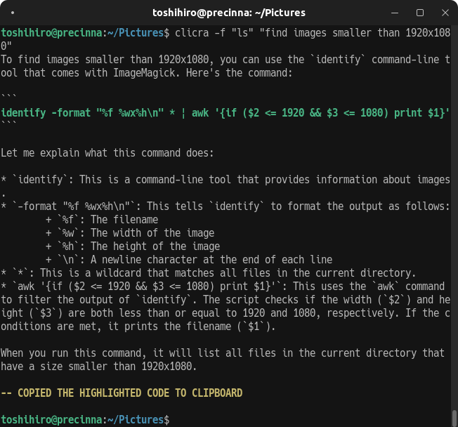

# clicra: Command Line Crafter

`clicra` is a command-line tool that utilizes local large language models (LLMs) to generate and analyze command lines based on tasks provided by users.

## Installation

`clicra` requires `Ollama` to be installed beforehand. Please follow the instructions on the official Ollama website.

1. Visit Ollama at [https://ollama.com/](https://ollama.com/).
2. Download the installer from the Download section.
3. Execute the downloaded installer.

After installing Ollama, you can install `clicra`. Use `pipx`, a package manager for Python applications:

```sh
pipx install clicra
```

To uninstall:

```sh
pipx uninstall clicra
```

## Usage

To run `clicra`, provide a description of the task you want to execute as a command-line argument:

```sh
clicra [options] <task>
```

### Options

- `-m, --model`: Specifies the LLM to use (default is `llama3`).
- `-f, --refer`: Executes a specified command and uses its output as additional context to improve the accuracy and relevance of task command generation.
- `-M, --max-chars`: Specifies the maximum number of characters to include from the referred command's output in the prompt (default is `2000`).
- `-r, --run`: Instead of copying the generated command to the clipboard, it executes the command immediately without confirmation, and analyzes the outcome if there are errors (non-zero exit code).
- `-s, --script`: Generates a script instead of a command.
- `--p, --prompt`: Ask for a prompt to describe the solution (**experimental feature**). `tot` for Tree-of-Thought. `sbs` for Step-by-Step.

### Examples

To find source files containing TODO comments, you can provide the output of `ls` as context. This allows `clicra` to recognize the directory structure and file types:

```sh
clicra "Find TODOs in source files" -f "ls"
```

## Screenshots


