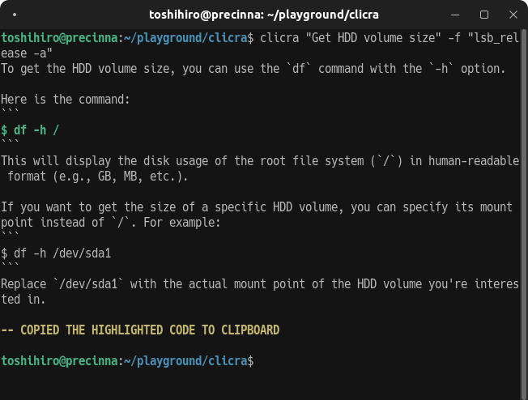

### clicra: Command Line Crafter

`clicra` is a command-line tool that utilizes local large language models (LLMs) to generate and analyze command lines based on tasks provided by users.

## Installation

`clicra` requires `Ollama` to be installed beforehand. Please follow the instructions on the official Ollama website.

1. Visit Ollama at [https://ollama.com/](https://ollama.com/).
2. Download the installer from the Download section.
3. Execute the downloaded installer.

After installing Ollama, you can install `clicra`. Use `pipx`, a package manager for Python applications:

```sh
pipx install clicra
```

To uninstall:

```sh
pipx uninstall clicra
```

## Usage

To run `clicra`, use the following syntax:

```sh
clicra [options] <task>
```

- `<task>`: Description of the task you want to execute.

### Options

- `-r, --run`: Generates and executes the command without confirmation and analyzes the outcome if there are errors.
- `-f, --refer`: Executes a specified command and uses its output as additional context to improve the accuracy and relevance of task command generation.
- `-m, --model`: Specifies the LLM to use (default is `llama3`).

### Examples

To find source files containing TODO comments, you can provide the output of `ls` as context. This allows `clicra` to recognize the directory structure and file types:

```sh
clicra "Find TODOs in source files" -f "ls"
```

To get the volume size of an HDD, using the output of `lsb_release -a` provides additional system information, helping to generate the correct command:

```sh
clicra "Get HDD volume size" -f "lsb_release -a"
```

## Screenshots

Here is a screenshot of `clicra` in use:


